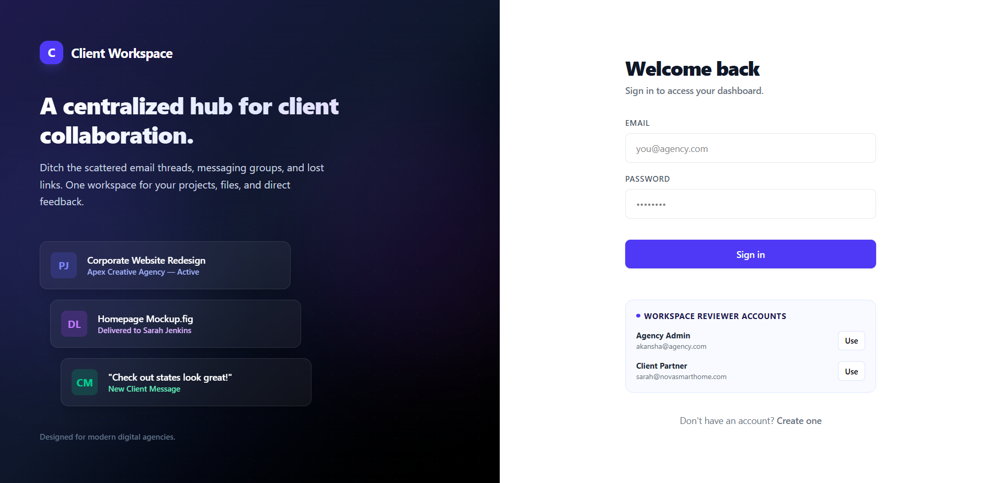
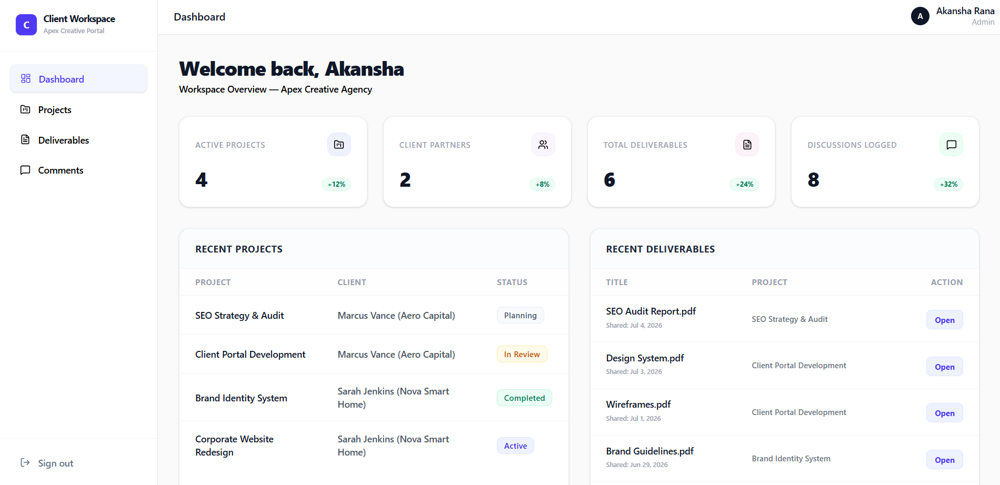
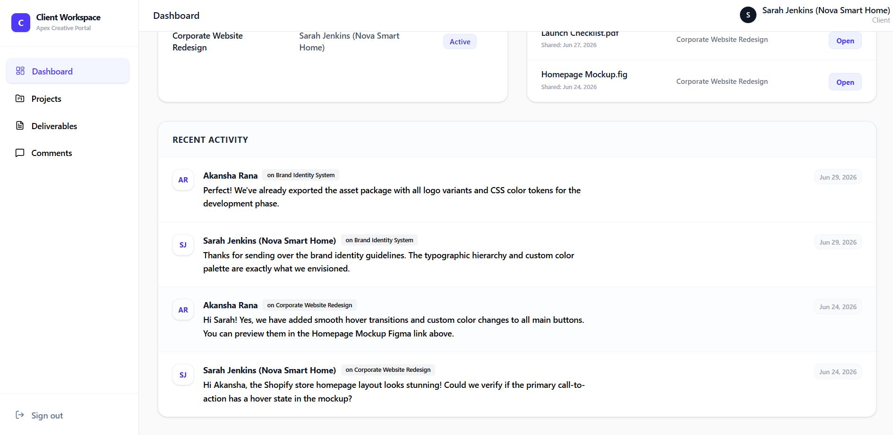

# Client Workspace

> A full-stack client collaboration platform that centralizes projects, deliverables, and communication between digital agencies and their clients.



---

## Overview

Managing client projects across email, messaging apps, cloud storage, and spreadsheets often results in fragmented communication, version conflicts, and limited project visibility.

**Client Workspace** brings the entire collaboration workflow into one centralized platform where agencies can manage projects, share deliverables, collect client feedback, and provide role-based access through a secure dashboard.

The application demonstrates a production-style full-stack architecture with authentication, authorization, REST APIs, and PostgreSQL.

---

## Features

### 🔐 Role-Based Authentication

- JWT-based authentication
- Protected routes
- Separate Admin and Client workspaces
- Secure session management

### 📁 Project Management

- Create and manage projects
- Assign projects to clients
- Track project status
- Centralized project dashboard

### 📄 Deliverable Management

- Upload and organize project deliverables
- Associate files with specific projects
- Track upload history
- Easy file access for clients

### 💬 Client Collaboration

- Threaded project discussions
- Client feedback workflow
- Admin replies
- Activity history

### 📊 Dashboard

- Workspace overview
- Project statistics
- Client statistics
- Recent deliverables
- Recent activity timeline

---

## Screenshots

### Admin Dashboard



### Client Workspace



---

## Tech Stack

### Frontend

- React 19
- Vite
- React Router
- Tailwind CSS v4
- Axios
- Lucide React

### Backend

- Node.js
- Express.js
- JWT Authentication

### Database

- PostgreSQL
- Neon Serverless PostgreSQL

---

## Architecture

```
React Client
       │
       ▼
Express REST API
       │
 JWT Authentication
       │
       ▼
 PostgreSQL Database
```

---

## Project Structure

```text
client-workspace
│
├── client
│   ├── public
│   ├── src
│   │   ├── assets
│   │   ├── component
│   │   ├── context
│   │   ├── pages
│   │   ├── routes
│   │   ├── services
│   │   ├── styles
│   │   └── utils
│   └── package.json
│
├── server
│   ├── controllers
│   ├── middleware
│   ├── models
│   ├── routes
│   ├── seed.js
│   └── package.json
│
├── docs
│   └── images
│       ├── admin.png
│       └── client.png
│
└── README.md
```

---

## Getting Started

### Clone Repository

```bash
git clone https://github.com/your-username/client-workspace.git

cd client-workspace
```

---

### Backend

```bash
cd server

npm install

npm run seed

npm run dev
```

The backend runs on:

```
http://localhost:5000
```

---

### Frontend

```bash
cd client

npm install

npm run dev
```

The frontend runs on:

```
http://localhost:5173
```

---

## Environment Variables

### Client

```env
VITE_API_URL=http://localhost:5000/api
```

### Server

```env
DATABASE_URL=your_postgresql_connection

JWT_SECRET=your_secret_key
```

---

## Demo Credentials

Run

```bash
npm run seed
```

to generate the demo Admin and Client accounts.

The credentials are available in:

```
server/seed.js
```

---

## Future Improvements

- Real-time messaging using WebSockets
- File uploads with cloud storage
- Email notifications
- Activity timeline
- Team workspaces
- Calendar integration
- Project search and filtering
- Notification center

---

## What I Learned

While building this project, I strengthened my understanding of:

- JWT Authentication
- Role-Based Authorization
- REST API Design
- PostgreSQL Database Design
- React Context API
- Full-Stack Application Architecture
- Client-Server Communication
- Protected Routes
- State Management

---

## License

This project is intended for educational and portfolio purposes.